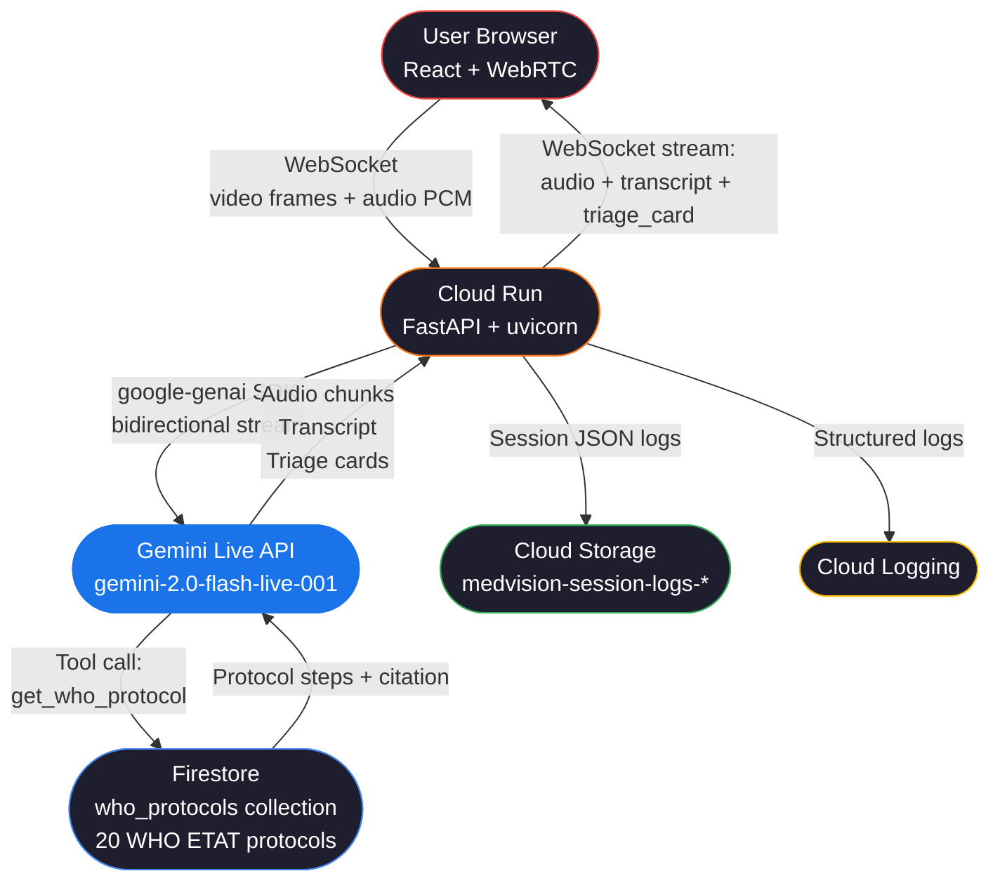

# MedVision — Real-Time Multimodal Emergency Medical Agent

> **Gemini Live Agent Challenge submission**
> Category: Live Agent (Gemini Live API + real-time audio/vision)

---

## Problem

**4.5 million people die annually** from lack of timely access to emergency medical guidance.
Rural first responders and community health workers operate without expert consultation, relying on memory and printed cards for decisions that must be made in seconds.

## Solution

MedVision is a real-time multimodal emergency medical agent that:

- **SEES** the patient through the camera (WebRTC video frames → Gemini Live)
- **HEARS** the first responder via bidirectional voice (Web Audio API → Gemini Live)
- **SPEAKS** back WHO-grounded guidance in any of 10 languages
- **GENERATES** structured triage cards with zero hallucinations (grounded in Firestore)
- **INTERRUPTS** on demand — critical for fast-moving emergencies

---

## Architecture



### Data flow detail

| Step | Description |
|------|-------------|
| 1 | Browser opens WebSocket to Cloud Run `/live` |
| 2 | Camera frames (JPEG, 2fps) and audio (PCM 16kHz) stream over WebSocket |
| 3 | FastAPI forwards to Gemini Live bidirectional stream via `google-genai` SDK |
| 4 | Gemini calls `get_who_protocol(condition)` tool → Firestore returns authoritative steps |
| 5 | Gemini emits audio + text with `[TRIAGE_CARD]{...}[/TRIAGE_CARD]` markers |
| 6 | FastAPI parses markers, validates, emits `triage_card` events to browser |
| 7 | Session end: full event log saved as JSON to Cloud Storage |

---

## Tech Stack

| Layer | Technology |
|-------|-----------|
| AI Model | `gemini-2.0-flash-live-001` via Gemini Live API |
| SDK | `google-genai >= 1.0.0` |
| Backend | Python 3.11, FastAPI, uvicorn, WebSockets |
| Knowledge base | Firestore (20 WHO ETAT/ATLS protocols) |
| Session storage | Cloud Storage (JSON logs) |
| Observability | Google Cloud Logging |
| Frontend | React 18, TypeScript, Tailwind CSS 3, Vite |
| Audio | Web Audio API (PCM capture, waveform visualizer) |
| Video | WebRTC (`getUserMedia`) |
| Deployment | Cloud Run (min-instances=1, 2GB RAM, 2 CPU) |
| IaC | Terraform (Cloud Run, Firestore, GCS, IAM) |

---

## Quick Start

### Prerequisites

- Google Cloud project with billing enabled
- `gcloud` CLI authenticated: `gcloud auth application-default login`
- Node.js 20+, Python 3.11+

### Deploy backend (< 10 commands)

```bash
# 1. Set your project
gcloud config set project YOUR_PROJECT_ID

# 2. Clone or enter the repo
cd medvision/backend

# 3. Deploy everything (enables APIs, builds image, deploys Cloud Run, seeds Firestore)
chmod +x deploy.sh && ./deploy.sh

# The script prints the Cloud Run URL at the end.
# Example: https://medvision-abc123-uc.a.run.app
```

### Run frontend locally

```bash
# 4. Enter frontend directory
cd ../frontend

# 5. Copy env file and set the Cloud Run URL
cp .env.example .env
# Edit .env: set VITE_CLOUD_RUN_URL=https://medvision-abc123-uc.a.run.app

# 6. Install dependencies
npm install

# 7. Start dev server
npm run dev
# → Open http://localhost:3000
```

### Deploy with Terraform (optional)

```bash
# 8. Build and push image first
gcloud builds submit --tag gcr.io/YOUR_PROJECT_ID/medvision

# 9. Apply Terraform
cd backend/terraform
terraform init
terraform apply -var="project_id=YOUR_PROJECT_ID" -var="image=gcr.io/YOUR_PROJECT_ID/medvision"
```

### Verify deployment

```bash
# 10. Health check
curl https://medvision-abc123-uc.a.run.app/health
# → {"status":"ok","version":"1.0.0"}
```

---

## Key Features (Judging Criteria)

### Innovation & Multimodal UX (40%)

| Feature | Implementation |
|---------|---------------|
| Live camera vision | WebRTC → JPEG frames → Gemini multimodal input |
| Bidirectional voice | Web Audio PCM 16kHz → Gemini Live audio → PCM playback |
| Interrupt handling | `/interrupt` button + WebSocket `interrupt` message → instant cancellation |
| Inline triage cards | `[TRIAGE_CARD]{json}[/TRIAGE_CARD]` markers parsed in real-time |
| Multilingual | 10 languages; Gemini responds in the user's language |
| Live Latency | Real-time connection latency displayed in header |

### Technical Implementation (30%)

| Feature | Implementation |
|---------|---------------|
| `google-genai` SDK | `genai.Client().aio.live.connect()` |
| Firestore grounding | `get_who_protocol()` Gemini tool → zero hallucinations |
| Cloud Run min-instances=1 | `--min-instances 1` in deploy.sh + Terraform |
| Cloud Logging | `google.cloud.logging` + `CloudLoggingHandler` |
| Graceful degradation | Camera/mic errors are surfaced in UI; session continues on audio/vision only |

### Demo & Presentation (30%)

| Feature | Location |
|---------|---------|
| Architecture diagram | This README (Mermaid) |
| `deploy.sh` | `backend/deploy.sh` |
| Terraform | `backend/terraform/main.tf` |
| Health endpoint | `GET /health` → `{"status":"ok","version":"1.0.0"}` |
| Reproducible setup | This Quick Start section |

---

## WHO Protocol Coverage

20 conditions seeded from WHO ETAT 2016 and ATLS 10th edition:

`cardiac_arrest` · `severe_bleeding` · `choking` · `anaphylaxis` · `stroke` · `head_injury` · `burns` · `fractures` · `diabetic_emergency` · `seizure` · `drowning` · `poisoning` · `heat_stroke` · `hypothermia` · `chest_pain` · `difficulty_breathing` · `unconscious_patient` · `eye_injury` · `snake_bite` · `obstetric_emergency`

---

## Project Structure

```
medvision/
├── backend/
│   ├── main.py              FastAPI app + WebSocket /live endpoint
│   ├── agent.py             Gemini Live session manager
│   ├── knowledge.py         Firestore WHO protocol queries
│   ├── triage.py            [TRIAGE_CARD] parser + validator
│   ├── cloud_storage.py     Session log persistence to GCS
│   ├── seed_firestore.py    Seeds 20 WHO protocols
│   ├── Dockerfile
│   ├── requirements.txt
│   ├── deploy.sh
│   ├── .env.example
│   └── terraform/
│       └── main.tf          Cloud Run + Firestore + GCS + IAM
└── frontend/
    ├── src/
    │   ├── App.tsx           3-column layout
    │   ├── main.tsx
    │   ├── index.css
    │   ├── hooks/
    │   │   ├── useGeminiLive.ts   WebSocket lifecycle + state
    │   │   ├── useCamera.ts       WebRTC camera capture
    │   │   └── useAudio.ts        PCM audio recording
    │   └── components/
    │       ├── CameraFeed.tsx     Live video with LIVE badge
    │       ├── AgentVoiceBar.tsx  Animated waveform + transcript
    │       ├── TriageCard.tsx     Animated priority card
    │       ├── SessionLog.tsx     Real-time event log
    │       └── StatusBar.tsx      Connection status header
    ├── index.html
    ├── package.json
    ├── tailwind.config.ts
    ├── vite.config.ts
    └── .env.example
```

---

## GDG Profile

Built for the **Google Developer Groups Gemini Live Agent Challenge**.
Author GDG profile: _[Add your GDG profile link here]_

---

## License

MIT — see [LICENSE](LICENSE)
